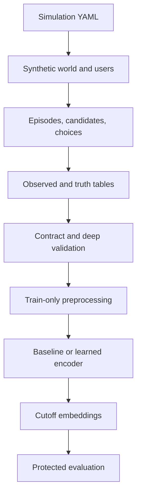

# Simulator and embedding data flow

This document describes the implemented v0.5 pipeline. The simulator and
embedding modules share the versioned `geoembeddings-dataset/1.0` contract.
Users provide a dataset root (`--run-dir`); code resolves every observed and
truth path centrally.

## Information boundary

```text
runs/kanto_pilot/
├── config.resolved.yaml
├── manifest.json
├── validation_report.json
├── deep_validation_report.json
├── observed/
│   ├── users_observed.csv.gz
│   └── observed_events.csv.gz
└── truth/
    ├── user_latents.csv.gz
    ├── episodes_truth.csv.gz
    ├── candidate_sets.csv.gz
    ├── choices_truth.csv.gz
    ├── trajectories_truth.csv.gz
    └── observation_process.csv.gz
```

`prepare`, `baseline`, `train`, and `export` resolve and read only
`observed/`. `evaluate` is the sole embedding command that receives the
resolved `truth/` path. The observed schema rejects columns that look like
latent traits, utilities, decisions, episode identifiers, chosen flags, or
true coordinates.

## End-to-end flow



The one-command baseline path is:

```bash
uv run geoembed pipeline \
  --run-dir runs/kanto_pilot \
  --experiment-dir experiments/kanto_baseline \
  --mode baseline
```

Use `--mode learned` to replace the statistical representation with GRU
training and embedding export.

## Simulator inputs

The canonical file is `configs/simulation/kanto_v1.yaml`.

| Section | Controls |
|---|---|
| `run` | cohort size, dates, seed, scenario |
| `world.spatial` | overlapping home, work, destination, and POI catchments |
| `world.regions` | Kanto anchors, relative density, regional price index, holdout flag |
| `world.poi_categories` | category appeal and normalized price prior |
| `population` | demographic mixtures and persistent latent-trait distributions |
| `episodes` | routine, leisure, shopping, family, and travel intent generation |
| `choice` | candidates, exposure, and stochastic utility coefficients |
| `observation` | service adoption, recording probability, GPS error, missingness |
| `events` | service-specific actions, rates, times, and catalog sizes |
| `scenarios` | controlled opportunity, exposure, noise, and dropout interventions |

### Random-stream lineage

The simulator resolves five independent named streams: `world`,
`user_latents`, `episodes`, `choices`, and `observation`. Their integer seeds
are derived from the root `run.seed`, stream name, and a versioned SHA-256
derivation label; derivation never uses Python's randomized `hash()` or the
order in which generators happen to be called. A stream can be overridden
under `run.random_streams` for controlled interventions. The resolved root,
algorithm, and stream seeds are recorded in `manifest.json`, while the resolved
stream map is also saved in `config.resolved.yaml`. Neither provenance record
is placed in `observed/`, and the public dataset tables and schema remain
unchanged.

### Stable identity and matchability contract (T1.11b; R5/R7)

`manifest.json.identity` uses schema
`geoembeddings-simulation-identity/1.0`. It records the
`sha256-root-seed-and-stream-name/1.0` derivation algorithm, root seed, all five
resolved stream seeds, identity-generation version `sha256-semantic-key/1.0`,
entity counts, and order-independent identity-set hashes under
`sha256-canonical-sorted-identifiers/1.0`. This is run-level metadata, so the
public `geoembeddings-dataset/1.0` tables did **not** change and need no
migration or contract-version bump.

The paired-run matching keys are: cohort-slot-derived user IDs; configured
region IDs; POI IDs derived from `(region_id, category, object_slot)`; episode
IDs derived from `(user_id, calendar_date)`; choice/decision IDs derived from
`(episode_id, primary_poi_choice)`; and trajectory keys derived from episode,
activity occurrence, and scheduled true time. Session IDs use user and date but
are not promoted to a manifest entity because sessions are observation-facing
grouping values rather than protected world objects. The cohort/object slots
are generation-domain keys, not output row numbers: sorting or rewriting CSV
rows cannot change an ID or identity-set hash. IDs use canonical UTF-8 JSON and
SHA-256, never Python `hash()`.

Across an observation-only pair, users, regions, POIs, episodes, choices, and
trajectories must all retain count and identity hash even though recorded event
rows, GPS/timestamps, adoption, and observation-process values may change.
Across later exposure/opportunity pairs, users, regions, POIs, episodes, and
decision keys are the matching backbone; chosen POI, exposure, utilities,
candidate membership under opportunity changes, and resulting true/observed
values are allowed to change. T1.11c/d will encode and enforce those
intervention-specific rules; T1.11b does not itself establish pair validity.

### Versioned pair declaration (T1.11c; R5/R7)

`geoembed pair-manifest` joins two complete run roots without copying protected
data into `observed/`. Its dedicated `geoembeddings-pair-manifest/1.0` artifact
contains both run identities and manifest/config/table/entity hashes, inferred
intervention and parameters, invariant entity classes, explicitly allowed field
changes, semantic user/time/object matching keys, both named-stream lineages,
and UTC/tool/runtime creation provenance. Observation-only pairs require all six
identity classes to match. Exposure/opportunity declarations preserve the
users/regions/POIs/episodes backbone while enumerating protected and observed
fields that later pair-integrity validation may permit to differ.

The pair declaration lives under a separate `PAIR_DIR/pair_manifest.json` and
is simulator/evaluator-side. Modeling commands have no pair-manifest argument
and continue to receive only a run root resolved to `observed/`. T1.11c validates
the declaration and hashes but does not inspect field-level equality; that
executable integrity check remains T1.11d.

### Pair integrity validation (T1.11d; R5/R7)

Run `geoembed validate-pair --pair-manifest PAIR_DIR/pair_manifest.json` before
any paired representation evaluation. The validator re-authenticates both run
roots and every declared input hash, compares schemas and unique semantic keys,
checks entity identities and stream lineage, and compares every observed and
truth field. Differences pass only when an intervention-specific wildcard or
field declaration explicitly permits them. The versioned sibling
`PAIR_DIR/pair_integrity.json` records coverage, missing/duplicate keys,
per-invariant outcomes, allowed-change counts, and precise bounded mismatch
samples. Missing, failing, or stale reports are a hard evaluation gate.

Passing establishes internal simulator-pair integrity only. It is not evidence
that the intervention corresponds to a real causal mechanism or that results
generalize outside the simulator.

The declarations remain in root `manifest.json` and refer to evaluator-only
truth entities without copying protected episodes, utilities, chosen flags, or
coordinates into `observed/`.

This refactor intentionally defines a new simulator artifact lineage. A root
seed remains repeatable within the named-stream algorithm, but its draws are
not promised to be bitwise compatible with artifacts produced by the earlier
single, call-order-dependent RNG.

### Interpreting normalized inputs

Several variables use convenient synthetic scales; they are not real units or
probabilities unless explicitly documented as probabilities.

For example, a restaurant `base_price` of `0.70` rather than `0.50` shifts the
mean of that category's generated price distribution upward by `0.20` before
POI-specific noise and clipping. It is not ¥700 and does not mean a 70% purchase
chance. The resulting POI price enters choice utility as a penalty whose size
also depends on the user's generated price sensitivity.

Likewise, regional `density: 0.72` is a relative simulation intensity. It
affects regional sampling and POI count through the formulas in the simulator;
it is not people per square kilometre.

## Simulator outputs

### `observed/users_observed.csv.gz`

One public row per simulated user. It contains coarse demographic information,
home region/prefecture, geographic split, and service-adoption indicators. It
does not contain exact home/work coordinates or latent preferences.

### `observed/observed_events.csv.gz`

One row per recorded cross-service event. Fields include user, timestamp,
service, action, observation mode, object/category, observed coordinates,
region, geohash-5, geohash-7, accuracy, source, and session.

This is the chronological history encoded by the embedding model.

### Truth tables

| File | Evaluator-only content |
|---|---|
| `user_latents.csv.gz` | exact home/work and persistent latent traits |
| `episodes_truth.csv.gz` | generated user-day intent and destination |
| `candidate_sets.csv.gz` | alternatives, exposure, utility components, chosen flag |
| `choices_truth.csv.gz` | stochastic chosen item and its episode/context |
| `trajectories_truth.csv.gz` | exact latent stops before observation noise |
| `observation_process.csv.gz` | adoption, recording, GPS, and interval policy by service |

## Embedding preprocessing

`prepare` performs the handoff from the simulator contract to model-ready
metadata. It:

1. validates the two observed tables and rejects truth-like fields;
2. sorts events by user and timestamp;
3. computes global chronological train/validation/test cutoffs;
4. builds categorical vocabularies from training events only;
5. fits continuous normalization statistics from training events only;
6. stores source hashes and resolved settings under the experiment directory.

The source events are not copied.

```text
experiments/kanto_single_vector/
├── prepared/
│   ├── config.resolved.yaml
│   ├── prepared_metadata.json
│   └── vocabularies.json
├── model/
│   ├── best_model.pt
│   └── training_report.json
├── embeddings.npz
├── dense_embeddings.npz
├── statistical_baseline.npz
├── evaluation.json
└── baseline_evaluation.json
```

## Model input and target

For a target event at time `t`, the learned model receives at most the previous
64 observed events for that user. Each event contains separate categorical
embeddings for service, action, observation mode, category, region, geohash-5,
and geohash-7, plus standardized coordinates, elapsed time, cyclic hour/day,
and location accuracy. `object_id` is disabled by default to reduce memorization.

The baseline represents each user history with normalized categorical
histograms and continuous-feature means and standard deviations. The learned
encoder uses a GRU and emits a 128-dimensional history vector.

In addition to the backward-compatible three-cutoff `embeddings.npz`, the
`export-dense` command can write `dense_embeddings.npz` after every Nth observed
event. Its schema contains public user IDs, observed timestamps, cutoff kind,
history counts, and embeddings only. Protected episode labels are joined later
by evaluator code, never by the exporter or model.

## Training objective

The default learned objective combines next-event heads with cross-window
consistency:

\[
\mathcal L =
0.2L_{service}+0.4L_{action}+1.0L_{category}+0.75L_{region}
+0.5L_{geohash5}+0.25L_{geohash7}+0.1L_{consistency}.
\]

This baseline deliberately exposes the tension between context sensitivity and
persistent stability. It does not claim that one vector disentangles
persistent traits, routines, and current episode state.

## Evaluation

The current evaluator reports:

- next-event loss and top-k accuracy for a learned checkpoint;
- frozen ridge probes for eight simulator latent traits;
- cosine stability between train, validation, and final cutoffs;
- a machine-readable status for the prioritized representation requirements.

Because truth is accessed only at this stage, probes measure information present
in a frozen representation without leaking it into training.

## Path contract

All public commands use the same two roots:

```text
--run-dir         simulator dataset root
--experiment-dir  embedding artifacts root
```

Users never pass `observed/`, `truth/`, `prepared/`, checkpoint, or embedding
filenames manually. See `docs/MIGRATION.md` for the exact mapping from the two
earlier projects.
